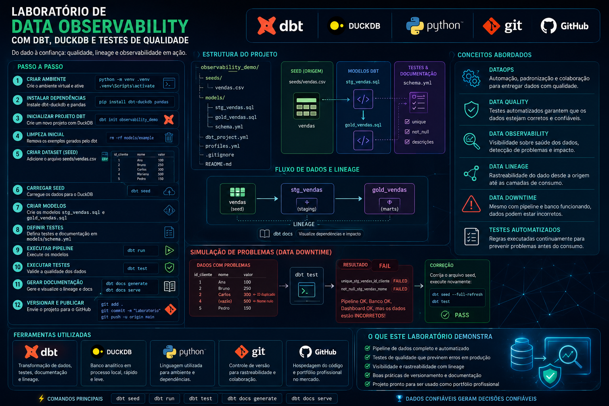

# 🚀 Data Observability com dbt

## 📊 Visão Geral




## 🛠️ Tecnologias Utilizadas


----------  


Um pipeline pode executar com sucesso, um dashboard pode ser atualizado e ainda assim os dados podem estar errados.  
Este laboratório demonstra na prática conceitos modernos de DataOps, Data Quality, Data Observability, Data Lineage e Data Downtime utilizando ferramentas amplamente adotadas pelo mercado.  

----------  

## 🎯 Objetivos
Este projeto demonstra como:  
- Construir um pipeline de dados local utilizando dbt e DuckDB
- Aplicar testes automatizados de qualidade
- Detectar problemas antes que cheguem ao dashboard
- Gerar documentação automática
- Visualizar dependências através de lineage
- Simular cenários de Data Downtime
- Versionar projetos de dados utilizando Git


----------  


## 🏗️ Arquitetura
```
vendas.csv
    │
    ▼
dbt Seed
    │
    ▼
stg_vendas
    │
    ▼
gold_vendas
```

----------  

## 📂 Estrutura do Projeto
```
observability_demo/
│
├── seeds/
│   └── vendas.csv
│
├── models/
│   ├── stg_vendas.sql
│   ├── gold_vendas.sql
│   └── schema.yml
│
├── .gitignore
├── README.md
│
├── dbt_project.yml
├── profiles.yml
│
├── target/
├── logs/
└── .venv/
```
----------  

## ⚙️ Instalação
### Criar ambiente virtual
Windows  
```
python -m venv .venv
.venv\Scripts\activate
```

Linux/Mac
```
python3 -m venv .venv
source .venv/bin/activate
```

### Instalar dependências
```
pip install uv
uv pip install dbt-duckdb pandas
```

----------  


## 🔍 Validar Instalação
```
dbt –version
```
Resultado esperado:
```
Core:
  - installed: 1.11.x

Plugins:
  - duckdb: 1.10.x
```

----------  

## 📥 Carregar Dados
```dbt seed```

----------  

## ⚡ Executar Pipeline
```dbt run```

## ✅ Executar Testes
```dbt test```

----------  

## 📚 Gerar Documentação
```dbt docs generate```

----------  

## 🌐 Abrir Documentação
``` dbt docs serve ```  
#### Acesse o navegador para visualizar:
- Documentação dos modelos
- Dependências entre objetos
- Data Lineage
- Testes aplicados
- Metadados

----------  

## 🚨 Simulando Data Downtime
Altere o arquivo:
> seeds/vendas.csv

Para incluir problemas como:  
- IDs duplicados
- Valores nulos
- Dados inconsistentes

Atualize:  
```dbt seed --full-refresh```  

Execute novamente:  
```dbt test```
Observe os testes falhando e analise o impacto no pipeline.  

----------  

## 🔄 Restaurando os Dados
Após corrigir os dados:
```
dbt seed --full-refresh

dbt test
```  

Resultado esperado:  
```PASS```


----------  

## 📈 Conceitos Demonstrados
- DataOps
Automação, padronização e governança de pipelines de dados.
- Data Quality
Validação automática da qualidade dos dados.
- Data Observability
Capacidade de detectar e investigar problemas nos dados.
- Data Lineage
Rastreabilidade completa do fluxo dos dados.
- Data Downtime
Período em que decisões são tomadas com dados incorretos.
- Testes Automatizados
Regras executadas continuamente para reduzir riscos em produção.

----------  


## 🧪 Principais Comandos
```
dbt seed

dbt run

dbt test

dbt docs generate

dbt docs serve
```


----------  

## 💡 Reflexão
Durante o laboratório observamos que:  
- O banco pode estar funcionando
- O pipeline pode executar com sucesso
- O dashboard pode ser atualizado

E ainda assim:  
Os dados podem estar incorretos.  
É exatamente para reduzir esse risco que utilizamos práticas de DataOps, testes automatizados, observabilidade e governança de dados.  


----------  

## 📜 Licença
Este projeto foi desenvolvido para fins educacionais e demonstração de práticas modernas de DataOps e Data Observability.